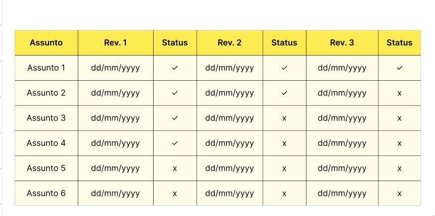

 

 

Uma aplicação web dedicada a estudantes que querem criar e gerenciar flashcards de maneira simples, organizada e agradável aos olhos.

## Descrição

Se você acabou de conhecer o método de memorização através de flashcards, deve ter se deparado com vários aplicativos que permitem a criação desses cartões e o agrupamento deles em decks. Porém, ou esses aplicativos não oferecem uma maneira de organizar a rotina de revisão desses flashcards ou a maneira oferecida é estranha, pouco intuitiva, pouco agradável aos olhos...

A proposta do Revisionmaster é justamente combinar a simples criação e agrupamento de flashcards com uma organização intuitiva e visual, ou seja, que você consegue compreender plenamente e que deixa você com mais controle sobre sua rotina de revisão e estudos, sem depender de ferramentas externas.

## Funcionalidades

- **Planos de estudo:** no Revisionmaster, um plano de estudo é um contêiner onde você agrupa todos os decks de flashcards relacionados a uma "linha de estudo". Por exemplo: se você está estudando para uma prova da escola e, ao mesmo tempo, para o curso de mecânico automotivo que você está fazendo, é uma boa ideia separar esses estudos em lugares diferentes, certo? Porém, fica ao seu critério separar os decks ou colocá-los em um plano só.
- **Tabela de revisão:** disiplina, assunto, 1º revisão, 2º revisão... Com o Revisionmaster, você não precisa anotar essas informações manualmente em algum lugar. Dentro de cada plano de estudo, há uma tabela que organiza automaticamente essas informações pra você. Uma tabela semelhante a demonstrada abaixo vai ser gerada e atualizada conforme você cria novos decks e novas categorias. A informação em cada coluna vai depender da frequência de revisão que você determinar nas configurações do plano de estudo:

 

- **Criação de flashcards, decks e categorias:** em cada plano de estudo você pode, obviamente, criar decks \(um grupo de flashcards relacionados ao mesmo assunto\), mas também pode separá-los em categorias. Essas categorias podem ser usadas para filtrar os decks e achá-los mais facilmente.

## Acesso ao projeto

**Site ao vivo:** em breve

 

## Tecnologias utilizadas

- NextJS
- TailwindCSS
- Firebase
- Codeium (uma IA gratuita de progamação)
